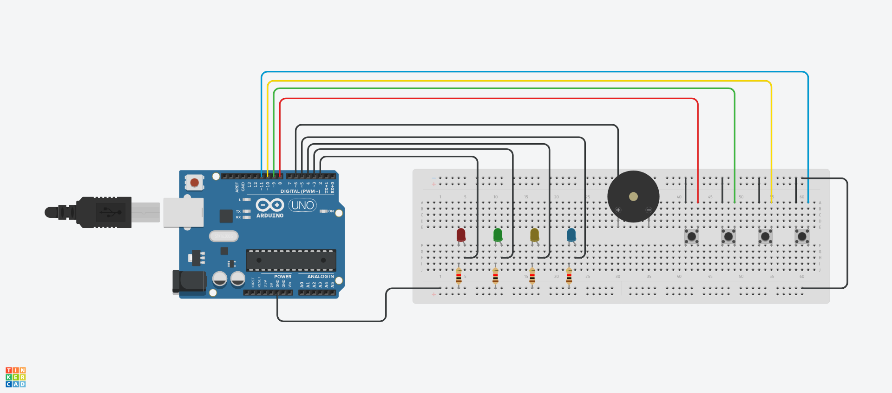

# Projeto Arduino: Jogo de Memória

## Integrantes da Dupla
- Gustavo Tadeu Melgaço Valeriano
- Rubens Dias Bicalho

## Professore Responsável
- João Paulo Aramuni

- ## Link do Projeto
- [CLIQUE AQUI](https://www.tinkercad.com/things/hZyFr02HP5V-lip-genius-gustavo-e-rubens/editel?sharecode=DY9YN8mJjslTjV_UCL9eCXGVqxgjcB-p5ooCpdO8AVU)

## Créditos
Este projeto foi desenvolvido como parte do curso de Ciência da Computação da Pontifícia Universidade Católica de Minas Gerais (PUC Minas).

## Descrição do Projeto
Este projeto consiste em um jogo de memória usando o Arduino. O objetivo do jogo é seguir a sequência de LEDs acesos e sons emitidos pelo buzzer. A cada rodada, a sequência aumenta em um passo, tornando o jogo progressivamente mais difícil.

### Componentes Utilizados
- Arduino Uno
- 4 LEDs
- 4 Resistores de 220 Ohms
- 4 Botões
- 1 Buzzer
- Jumpers
- Protoboard

### Esquema de Ligação

